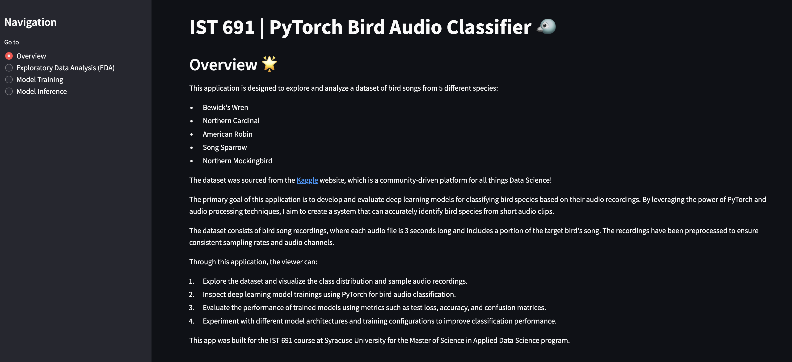
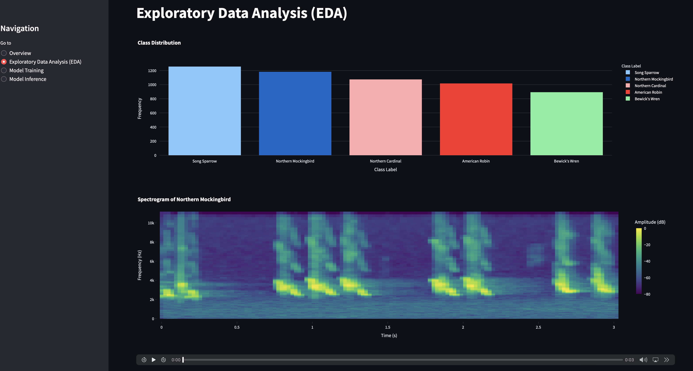
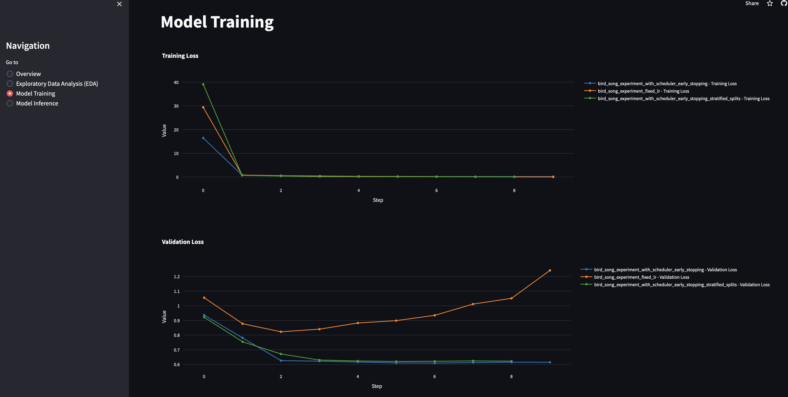

# IST 691 Project for 'Deep Learning in Practice' Course at Syracuse University

Welcome to the repository for the Deep Learning in Practice project, a component of the IST 691 course at Syracuse University's Master of Science in Applied Data Science program. This project utilizes artificial nueral networks to provide insightful analysis and interactive features around a specific audio classification dataset. The data consists of publicly available bird song recordings that were sourced from .

## Features

The project overlays several key components designed to communicate the process of training and evaluating the deep learning models:

- **Exploratory Data Analysis (EDA):** Illustrates the class imbalance of the dataset and allows the viewer to sample source audio and spectrogram files.
- **Model Training:** Trains models with various tuned parameters to inevitibly leverage the strongest, best performing model in the inference stage.
- **Model Inference:** Offers an interactive viewing experience for viewers to learn about model training parameters and results

## Streamlit Application

To provide a user-friendly and interactive experience, a Streamlit application has been developed. This web application brings the project's features to life, allowing for real-time interaction and exploration.

Access the Streamlit app here: [https://ist691-syracuse.streamlit.app](https://ist691-syracuse.streamlit.app)

## Streamlit Application Images






## Getting Started

To run this project locally, ensure you have Python and Streamlit installed. Clone this repository, navigate to the project directory, and execute the Streamlit application:

```bash
git clone -b deploy https://github.com/matthewpergolski/IST_691.git
cd IST_691
streamlit run scripts/app.py
```

To download the Kaggle dataset, obtain a `kaggle.json` API key from [Kaggle](https://www.kaggle.com), sign up or log in, and place into the `/config` folder.  From there, open a terminal and execute the following command: `bash ./config/download_kaggle_dataset.sh`.
